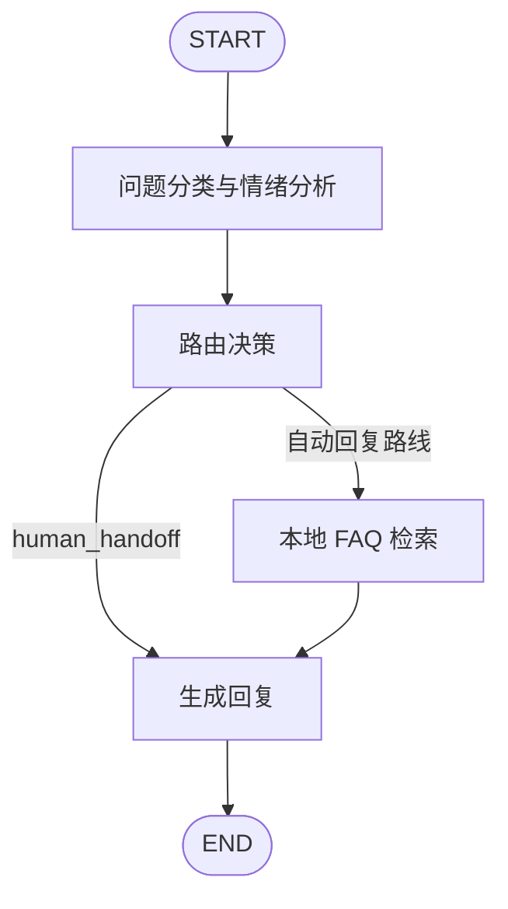

# Intelligent Customer Service Agent - Xiao Zhi

一个用于学习 Agent 工作流的中文智能客服项目。项目以 Python 和 LangGraph 实现了问题分类、情绪判断、条件路由、本地 FAQ 检索、人工转接和终端交互。

项目同时保留两条实现路线：

- 规则版：使用关键词完成分类和情绪判断，适合稳定、免费地运行本地测试。
- 大模型版：使用一次 OpenAI 兼容模型请求同时完成分类和情绪分析，并在 FAQ 命中后受控改写回复；路由和 FAQ 检索继续复用本地规则。

这是一项学习和作品集项目，不是可直接投入生产的客服系统。

## Features

- 明确的 `CustomerState` 状态结构，保存 `query`、`category`、`sentiment`、`route` 和 `response`。
- 三类问题分类：`technical`、`billing`、`general`。
- 三类情绪判断：`positive`、`neutral`、`negative`。
- 负面情绪优先转人工客服。
- LangGraph 状态图和条件边：人工转接跳过 FAQ，自动路线进入 FAQ 检索。
- 本地 FAQ 知识库：退款时效、客服工作时间和密码重置。
- 意图感知的 FAQ 检索：分别判断业务主题关键词和用户意图关键词，减少 FAQ 误命中。
- OpenAI 兼容模型分析器，一次返回分类和情绪，支持 JSON 输出、字段范围校验及重复 JSON 恢复。
- 模型分析请求失败或任一字段不合法时，同时降级到本地分类和情绪规则，并记录分析来源和错误类型。
- 发生分类降级时，向用户展示友好提示，同时不暴露底层异常名称。
- 受控回复模块只根据已命中的 FAQ 答案组织语言；人工转接、无 FAQ 或分类降级时不会调用回复模型。
- 回复模型失败时自动回退到 FAQ 原文，并记录回复来源和错误类型。
- 多样本评估集和评估报告，统计分类、情绪、路由和 FAQ 状态准确率，以及模型降级次数。
- 本地 `unittest` 测试，不在单元测试中发起真实模型请求。

## Architecture



规则版分别执行 `categorize_query` 和 `analyze_sentiment`。大模型版使用一个 `analyze_query_with_model` 节点一次生成两个字段：

```text
用户问题
-> OpenAI 兼容模型分类与情绪分析
-> JSON 解析与校验
-> 本地路由和 FAQ 检索
-> 受控模型回复或本地安全回复
```

如果模型分析失败，分析节点会同时改用本地分类和情绪规则，并继续执行后续节点：

```text
模型分析失败
-> 本地分类与情绪分析降级
-> 本地路由、FAQ 和回复
```

## Project Structure

```text
src/
  agent.py                Rule nodes, state definition, and manual workflow baseline
  cli.py                  Interactive CLI for the rule-based workflow
  evaluation_cases.py     Evaluation samples and expected labels
  evaluation_runner.py    Batch evaluation and summary metrics
  knowledge_base.py       Local FAQ data and intent-aware lookup
  langgraph_agent.py      Rule-based LangGraph workflow
  langgraph_llm_agent.py  LLM-classification LangGraph workflow
  model_config.py         .env loading and model configuration validation
  model_client.py         OpenAI-compatible client construction
  model_probe.py          Minimal live model connection probe
  llm_classifier.py       Combined LLM classification and sentiment analysis
  llm_responder.py        Controlled LLM reply request and response validation
  observability.py        Format classification and response sources for debugging
  llm_cli.py              Interactive CLI for the LLM workflow
tests/
  test_agent.py                 Rule-based workflow tests
  test_evaluation_runner.py     Evaluation behavior tests with mocked workflow results
  test_knowledge_base.py        FAQ lookup tests
  test_llm_classifier.py        Local LLM classifier tests with mocked API requests
  test_langgraph_llm_agent.py   LLM LangGraph tests with mocked classification
  test_llm_responder.py         Controlled LLM reply tests with mocked API requests
  test_observability.py         Observability formatting tests
```

## Quick Start

The project was tested with Python 3.13.14 on Windows PowerShell.

```powershell
py -m venv .venv
.\.venv\Scripts\Activate.ps1
python -m pip install -r requirements.txt
```

Run all local tests:

```powershell
python -m unittest discover -s .\tests -v
```

The current local suite contains 37 tests. It does not call a real model API.

Run the evaluation set:

```powershell
python -m src.evaluation_runner
```

The evaluation runner executes the LLM workflow on 9 labeled cases and compares
the actual category, sentiment, route, and FAQ state with the expected results.
It makes real model requests and may incur API cost. The cases cover billing,
technical, general, positive, neutral, negative, FAQ hits, FAQ negative
controls, and password reset.

Run the rule-based interactive CLI:

```powershell
python -m src.cli
```

Run the LLM workflow interactive CLI (requires `.env` and may incur API cost):

```powershell
python -m src.llm_cli
```

## Model Configuration

Copy `.env.example` to `.env`, then set the values provided by an OpenAI-compatible model service:

```dotenv
OPENAI_COMPATIBLE_BASE_URL=https://your-provider.example/v1
OPENAI_COMPATIBLE_API_KEY=your-api-key
OPENAI_COMPATIBLE_MODEL=your-model-name
```

Never commit `.env` or a real API key.

Verify the model connection with one small live request:

```powershell
python -m src.model_probe
```

Run the complete LLM LangGraph flow with one live analysis request and, when FAQ is found, one controlled reply request:

```powershell
python -c "from src.langgraph_llm_agent import run_langgraph_llm_customer_service_agent; print(run_langgraph_llm_customer_service_agent('退款一般多久到账？'))"
```

For this query, the expected route is `billing_reply`, and the local FAQ answer is used as the final response.

## Test Strategy

- The local suite currently contains 37 tests and does not make real model API requests.
- Rule and FAQ tests exercise deterministic local business logic.
- FAQ tests cover both positive matches and negative controls, including a query
  where a refund has already arrived and therefore should not use a refund-timing answer.
- LLM parser tests cover valid combined analysis, repeated identical JSON, invalid JSON, unsupported categories or sentiments, missing fields, and contradictory JSON objects.
- LLM coordination tests mock `request_model_analysis`, so no API request is made.
- LLM LangGraph tests mock `analyze_with_model`, while real routing, FAQ, and response nodes still execute.
- LLM LangGraph tests also cover an API timeout and verify that rule-based classification takes over.
- The fallback path also verifies that the final user-facing message remains readable.
- Controlled responder tests validate FAQ input protection, JSON parsing, repeated outputs, and contradictory outputs.
- LangGraph responder tests verify model rewriting, human-handoff skipping, missing-FAQ skipping, classification-fallback skipping, and FAQ fallback after reply timeout.
- Evaluation runner tests verify that semantically correct rule fallback and FAQ fallback results are recorded with their separate source fields.
- The evaluation runner reports category, sentiment, route, and FAQ-state accuracy, plus analysis and response source counts.
- Observability tests verify source and error information formatting without making API requests.
- Live probes and live end-to-end commands are intentionally separate from `unittest`, because they depend on network availability, API credentials, quota, and model-service behavior.

## Known Limitations

- The rule-based workflow still uses keyword sentiment analysis, while the LLM workflow obtains sentiment together with category in one request.
- FAQ retrieval uses an in-memory knowledge base with required topic keywords and intent keywords. It is more precise than a simple keyword count, but it is not a vector-based RAG system.
- Prompt restrictions and JSON validation reduce model risk but cannot prove semantic faithfulness; the original FAQ answer remains the trusted fallback.
- The local FAQ knowledge base is a small in-memory list with no source citations or versioning.
- Third-party model services can time out, be rate-limited, or return imperfect compatibility behavior. The classifier validates and safely handles repeated identical JSON, but conflicting results are rejected.
- There is no persistent conversation history, ticket system, database, authentication, rate limiting, observability, or human-agent backend.
- This project is appropriate for learning and portfolio demonstration, not direct production deployment.

## Security and Publishing Notes

- Do not commit `.env`, API keys, private logs, or real customer data.
- Keep `.venv`, `__pycache__`, and test caches out of version control.
- The implementation in this repository is an independent learning implementation. Do not copy code, assets, or documentation from third-party tutorial repositories without complying with their licenses.

## License

This project is released under the [MIT License](LICENSE).
