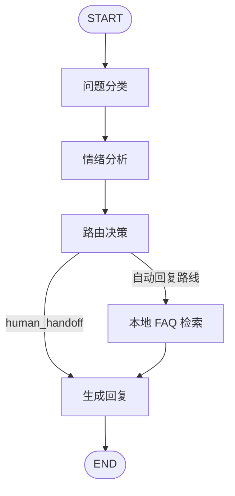

# Customer Service Agent Learning Project

一个用于学习 Agent 工作流的中文智能客服项目。项目使用 Python 和 LangGraph 实现了一个可运行的客服处理流程：问题分类、情绪识别、条件路由、本地 FAQ 检索、人工转接和终端交互。

这是一个规则驱动的学习项目，不是生产级客服系统，也尚未接入大模型 API。

## Features

- 将客服会话信息保存在明确的 `CustomerState` 状态中。
- 按关键词将问题分为技术、账单和通用咨询。
- 识别正面、中性和负面情绪。
- 负面情绪优先转人工客服。
- 使用 LangGraph 状态图协调节点执行。
- 使用条件边：转人工的问题跳过自动 FAQ 检索。
- 使用本地 FAQ 知识库回答退款时效、客服工作时间和密码重置问题。
- 提供命令行交互入口和 9 项 `unittest` 自动化测试。

## Architecture



自动回复的优先级如下：

```text
human_handoff -> 人工转接提示
FAQ 命中       -> FAQ 具体答案
其他自动路线   -> 通用回复模板
```

## Project Structure

```text
src/
  agent.py            Rule nodes, state definition, and manual workflow baseline
  langgraph_agent.py  LangGraph workflow and conditional routing
  knowledge_base.py   Local FAQ data and keyword-score lookup
  cli.py              Interactive command-line entry point
tests/
  test_agent.py       Agent workflow tests
  test_knowledge_base.py  FAQ lookup tests
```

## Quick Start

The project was tested with Python 3.13.14 on Windows PowerShell.

```powershell
py -m venv .venv
.\.venv\Scripts\Activate.ps1
python -m pip install -r requirements.txt
```

Run all tests:

```powershell
python -m unittest discover -s .\tests -v
```

Run the interactive CLI from the project root:

```powershell
python -m src.cli
```

Example input:

```text
退款一般多久到账？
```

Expected behavior:

```text
分类：billing
情绪：neutral
路线：billing_reply
客服回复：退款申请审核通过后，原路退款通常在 3 至 5 个工作日到账。
```

## Test Coverage

The current test suite verifies:

- Negative billing queries are handed to a human.
- Negative technical queries are handed to a human.
- Neutral general queries use the general reply route.
- The LangGraph workflow matches the rule-based baseline for human handoff.
- Refund timing queries use the FAQ answer.
- FAQ lookup behavior for complete, partial, and two-keyword refund queries.

## Known Limitations

- Classification and sentiment analysis use hand-written keyword rules and can miss paraphrases or mixed intents.
- FAQ retrieval uses keyword scoring, not semantic retrieval or vector search.
- The FAQ knowledge base is a small in-memory Python list with no source citations or versioning.
- There is no persistent conversation history, ticket system, database, authentication, rate limiting, or monitoring.
- No large language model is connected yet.
- This project is appropriate for learning and portfolio demonstration, not direct production deployment.

## Security and Publishing Notes

- Do not commit `.env`, API keys, private logs, or real customer data.
- Commit `.env.example` only after a model provider is introduced.
- Keep `.venv`, `__pycache__`, and test caches out of version control.
- The implementation in this repository is an independent learning implementation. Do not copy code, assets, or documentation from third-party tutorial repositories without complying with their licenses.

## License

This project is released under the [MIT License](LICENSE).
