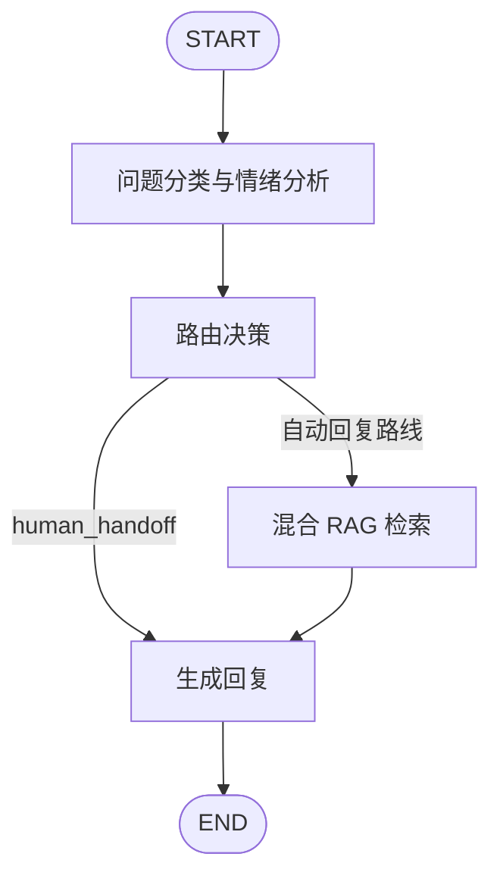

# Intelligent Customer Service Agent - Xiao Zhi

一个用于学习 Agent 工作流的中文智能客服项目。项目以 Python 和 LangGraph 实现了问题分类、情绪判断、条件路由、本地 FAQ 检索、人工转接和终端交互。

项目同时保留两条实现路线：

- 规则版：使用关键词完成分类和情绪判断，适合稳定、免费地运行本地测试。
- 大模型版：使用一次 OpenAI 兼容模型请求同时完成分类和情绪分析，并在 FAQ 命中后受控改写回复；路由和 FAQ 检索继续复用本地规则。

这是一项学习和作品集项目，不是可直接投入生产的客服系统。

## Features

- 明确的 `CustomerState` 状态结构，保存 `query`、`category`、`sentiment`、`route` 和 `response`。
- 三类问题分类：`technical`、`billing`、`general`。
- 三类情绪判断：`positive`、`neutral`、`negative`。
- 负面情绪优先转人工客服。
- LangGraph 状态图和条件边：人工转接跳过 FAQ，自动路线进入 FAQ 检索。
- JSON 版本化 FAQ 知识库：退款时效、客服工作时间和密码重置。
- 轻量本地混合 RAG：严格主题/意图门槛 + TF-IDF 文本相似度 + Top-K 候选排序。
- 检索可追踪：保存 `faq_id`、`chunk_id`、知识库版本、规则分、文本分和最终上下文。
- OpenAI 兼容模型分析器，一次返回分类和情绪，支持 JSON 输出、字段范围校验及重复 JSON 恢复。
- 模型分析请求失败或任一字段不合法时，同时降级到本地分类和情绪规则，并记录分析来源和错误类型。
- 发生分类降级时，向用户展示友好提示，同时不暴露底层异常名称。
- 受控回复模块只根据已命中的 FAQ 答案组织语言；人工转接、无 FAQ 或分类降级时不会调用回复模型。
- 回复模型失败时自动回退到 FAQ 原文，并记录回复来源和错误类型。
- 多样本评估集和评估报告，统计分类、情绪、路由和 FAQ 状态准确率，以及模型降级次数。
- 评估结果保存 FAQ ID、实际检索上下文、检索分数、单条延迟、P95 延迟、模型调用次数和失败类型。
- 如果兼容模型返回 usage 信息，评估报告还会统计输入 Token、输出 Token 和可选成本估算。
- 本地 `unittest` 测试，不在单元测试中发起真实模型请求。

## Architecture



规则版分别执行 `categorize_query` 和 `analyze_sentiment`。大模型版使用一个 `analyze_query_with_model` 节点一次生成两个字段：

```text
用户问题
-> OpenAI 兼容模型分类与情绪分析
-> JSON 解析与校验
-> 本地路由和混合 RAG 检索
-> 受控模型回复或本地安全回复
```

当前 RAG 检索不依赖外部向量数据库或在线 Embedding API：

```text
JSON 知识文档
-> 启动时构建本地 TF-IDF 索引
-> 主题/意图规则硬门槛
-> TF-IDF 余弦相似度
-> 混合分数排序 Top-K
-> 阈值过滤
-> 将最佳上下文写入 CustomerState
```

其中规则门槛负责“是否允许进入候选集”，TF-IDF 负责“候选之间谁更相关”。
因此“退款已经到账，谢谢客服！”不会因为共享“退款”和“到账”而误用退款时效答案。

如果模型分析失败，分析节点会同时改用本地分类和情绪规则，并继续执行后续节点：

```text
模型分析失败
-> 本地分类与情绪分析降级
-> 本地路由、FAQ 和回复
```

## Project Structure

```text
src/
  agent.py                Rule nodes, state definition, and manual workflow baseline
  cli.py                  Interactive CLI for the rule-based workflow
  rag_retriever.py        Local TF-IDF index and keyword-TF-IDF hybrid retrieval
  evaluation_cases.py     Evaluation samples and expected labels
  evaluation_runner.py    Batch evaluation, summary metrics, and report persistence
  knowledge_base.py       Versioned JSON knowledge loading and compatibility lookup API
  langgraph_agent.py      Rule-based LangGraph workflow
  langgraph_llm_agent.py  LLM-classification LangGraph workflow
  model_config.py         .env loading and model configuration validation
  model_client.py         OpenAI-compatible client construction
  model_probe.py          Minimal live model connection probe
  llm_classifier.py       Combined LLM classification and sentiment analysis
  llm_responder.py        Controlled LLM reply request and response validation
  model_usage.py          Optional model usage extraction and cost estimation
  rule_baseline_runner.py Run the local rule-based benchmark
  llm_candidate_runner.py Run a cost-controlled LLM candidate benchmark
  compare_saved_reports.py Compare two saved evaluation report snapshots
  observability.py        Format classification and response sources for debugging
  llm_cli.py              Interactive CLI for the LLM workflow
tests/
  test_agent.py                 Rule-based workflow tests
  test_evaluation_runner.py     Evaluation behavior tests with mocked workflow results
  test_evaluation_cases.py      Evaluation-set structure and metadata tests
  test_compare_saved_reports.py Saved-report comparison tests
  test_llm_candidate_runner.py  Candidate-sample selection tests
  test_knowledge_base.py        FAQ lookup tests
  test_rag_retriever.py         JSON loading, TF-IDF and hybrid retrieval tests
  test_llm_classifier.py        Local LLM classifier tests with mocked API requests
  test_langgraph_llm_agent.py   LLM LangGraph tests with mocked classification
  test_llm_responder.py         Controlled LLM reply tests with mocked API requests
  test_observability.py         Observability formatting tests
data/
  knowledge_base.json            Versioned FAQ documents and retrieval metadata
```

## Quick Start

The project was tested with Python 3.13.14 on Windows PowerShell.

```powershell
py -m venv .venv
.\.venv\Scripts\Activate.ps1
python -m pip install -r requirements.txt
```

Run all local tests:

```powershell
python -m unittest discover -s .\tests -v
```

The current local suite contains 68 tests. It does not call a real model API.

Detailed implementation guides:

- `docs/project-flow-guide.md`：项目整体执行链路。
- `docs/evaluation-system-upgrade-guide.md`：结构化评估系统与基线比较。
- `docs/rag-system-upgrade-guide.md`：本轮 JSON 知识库、TF-IDF 和混合 RAG 的逐步说明。

Run the rule-based baseline evaluation:

```powershell
python -m src.rule_baseline_runner
```

This command runs 50 manually labeled evaluation cases with the rule-based
LangGraph workflow. It does not call a model API and saves detailed results and
a summary to `reports/baselines/<run_id>/`.

Run a small LLM candidate evaluation first:

```powershell
python -m src.llm_candidate_runner --limit 3
```

This is a cost-controlled smoke test for the model configuration and workflow.
It calls the real model API and saves the result to
`reports/candidates/<run_id>/`.

After confirming model behavior and cost, run the complete 50-case candidate
evaluation:

```powershell
python -m src.llm_candidate_runner --limit 50
```

Compare two already saved reports:

```powershell
python -m src.compare_saved_reports `
  --baseline-dir .\reports\baselines\<baseline_run_id> `
  --candidate-dir .\reports\candidates\<candidate_run_id>
```

The comparison command only reads existing `results.json` snapshots, validates
that both reports use the same ordered samples, and writes a comparison report.
It does not run the Agent or call a model API.

Run the rule-based interactive CLI:

```powershell
python -m src.cli
```

Run the LLM workflow interactive CLI (requires `.env` and may incur API cost):

```powershell
python -m src.llm_cli
```

## Model Configuration

Copy `.env.example` to `.env`, then set the values provided by an OpenAI-compatible model service:

```dotenv
OPENAI_COMPATIBLE_BASE_URL=https://your-provider.example/v1
OPENAI_COMPATIBLE_API_KEY=your-api-key
OPENAI_COMPATIBLE_MODEL=your-model-name
```

Never commit `.env` or a real API key.

Verify the model connection with one small live request:

```powershell
python -m src.model_probe
```

Run the complete LLM LangGraph flow with one live analysis request and, when FAQ is found, one controlled reply request:

```powershell
python -c "from src.langgraph_llm_agent import run_langgraph_llm_customer_service_agent; print(run_langgraph_llm_customer_service_agent('退款一般多久到账？'))"
```

For this query, the expected route is `billing_reply`, and the local FAQ answer is used as the final response.

## Evaluation Results

The project compares the rule baseline and the LLM candidate on the same 50
manually labeled evaluation cases.

The evaluation set covers:

- `technical`, `billing`, and `general` categories.
- `positive`, `neutral`, and `negative` sentiment.
- FAQ hits, FAQ negative controls, human handoff, colloquial phrasing,
  repetition, boundary cases, and mixed intents.
- `simple`, `medium`, and `complex` complexity levels.

The formal comparison reads saved reports rather than rerunning the model:

```text
reports/baselines/20260812-045748
reports/candidates/20260812-064421
reports/comparisons/20260812-071429
```

| Metric | Rule baseline | LLM candidate | Absolute change |
| --- | ---: | ---: | ---: |
| Overall pass rate | 44/50 (88.0%) | 49/50 (98.0%) | +10.0 percentage points |
| Category accuracy | 46/50 (92.0%) | 49/50 (98.0%) | +6.0 percentage points |
| Sentiment accuracy | 48/50 (96.0%) | 50/50 (100.0%) | +4.0 percentage points |
| Route accuracy | 45/50 (90.0%) | 49/50 (98.0%) | +8.0 percentage points |
| FAQ-state accuracy | 50/50 (100.0%) | 50/50 (100.0%) | +0.0 percentage points |
| FAQ ID accuracy | 50/50 (100.0%) | 50/50 (100.0%) | +0.0 percentage points |

On the same samples, in the same order, and with the same metrics, the LLM
candidate improves the overall pass rate from 88.0% to 98.0%. This is an
absolute improvement of 10.0 percentage points and a relative improvement of
11.4%.

The candidate analysis source was `llm: 50`. Its reply sources were `llm: 13`
and `local: 37`: only FAQ-hit questions that satisfy the controlled-reply
conditions call the reply model. Other routes intentionally use local replies.

Each newly generated report also records runtime metadata and operational
metrics:

- `metadata.runner`, `metadata.mode`, and `metadata.model_name`.
- Per-sample `retrieved_contexts`, `retrieval_score`, `retrieval_keyword_score`,
  `retrieval_text_score`, `retrieval_method`, `retrieval_candidates` and
  knowledge-base version.
- Per-sample latency and inferred model call count.
- Average latency, P95 latency, timeout count, parse-failure count, and failure
  type distribution.
- Token and cost fields are populated only when the model provider returns
  usage data and optional token prices are configured in `.env`.

The offline rule baseline also records RAG provenance. In the latest local
baseline run, 13 of 50 samples produced a trusted FAQ context, all through
`keyword_tfidf_hybrid_v1`, using knowledge-base version `2026.08.18`. This is
retrieval observability, not a claim that every user question should hit FAQ.

The 50-case dataset is still limited. These measurements are useful for
portfolio regression checks and controlled comparisons, but do not prove
production-level generalization.

## Test Strategy

- The local suite currently contains 68 tests and does not make real model API requests.
- Rule and FAQ tests exercise deterministic local business logic.
- FAQ tests cover both positive matches and negative controls, including a query
  where a refund has already arrived and therefore should not use a refund-timing answer.
- LLM parser tests cover valid combined analysis, repeated identical JSON, invalid JSON, unsupported categories or sentiments, missing fields, and contradictory JSON objects.
- LLM coordination tests mock `request_model_analysis`, so no API request is made.
- LLM LangGraph tests mock `analyze_with_model`, while real routing, FAQ, and response nodes still execute.
- LLM LangGraph tests also cover an API timeout and verify that rule-based classification takes over.
- The fallback path also verifies that the final user-facing message remains readable.
- Controlled responder tests validate FAQ input protection, JSON parsing, repeated outputs, and contradictory outputs.
- LangGraph responder tests verify model rewriting, human-handoff skipping, missing-FAQ skipping, classification-fallback skipping, and FAQ fallback after reply timeout.
- Evaluation runner tests verify that semantically correct rule fallback and FAQ fallback results are recorded with their separate source fields.
- The evaluation runner reports category, sentiment, route, and FAQ-state accuracy,
  source counts, retrieval evidence, latency, model-call counts, and failure
  statistics.
- Observability tests verify source and error information formatting without making API requests.
- Live probes and live end-to-end commands are intentionally separate from `unittest`, because they depend on network availability, API credentials, quota, and model-service behavior.

## Known Limitations

- The rule-based workflow still uses keyword sentiment analysis, while the LLM workflow obtains sentiment together with category in one request.
- FAQ retrieval uses a versioned JSON knowledge base and a local keyword-TF-IDF
  hybrid retriever. It is a real, traceable lightweight RAG layer, but it is not a
  semantic embedding/vector-database system. The strict keyword gate intentionally
  favors explainability and offline reproducibility over broad synonym generalization.
- Prompt restrictions and JSON validation reduce model risk but cannot prove semantic faithfulness; the original FAQ answer remains the trusted fallback.
- The local FAQ knowledge base is intentionally small and file-based. It now has
  source, version, update date and chunk metadata, but it is not yet connected to
  a production CMS or database.
- Third-party model services can time out, be rate-limited, or return imperfect compatibility behavior. The classifier validates and safely handles repeated identical JSON, but conflicting results are rejected.
- Token and cost metrics depend on whether the compatible provider returns a
  standard `usage` object. Cost estimation also requires optional
  `MODEL_INPUT_COST_PER_1K` and `MODEL_OUTPUT_COST_PER_1K` settings.
- There is no persistent conversation history, ticket system, database, authentication, rate limiting, observability, or human-agent backend.
- This project is appropriate for learning and portfolio demonstration, not direct production deployment.

## Security and Publishing Notes

- Do not commit `.env`, API keys, private logs, or real customer data.
- Keep `.venv`, `__pycache__`, and test caches out of version control.
- The implementation in this repository is an independent learning implementation. Do not copy code, assets, or documentation from third-party tutorial repositories without complying with their licenses.

## License

This project is released under the [MIT License](LICENSE).
