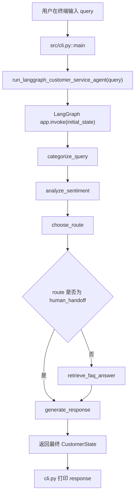
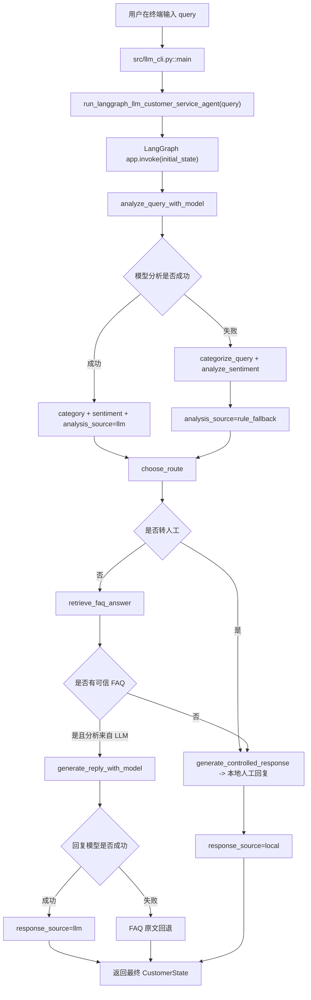

# Intelligent Customer Service Agent - Xiao Zhi

## 项目全流程复习手册

> 本文档基于项目当前源码整理，目标是帮助你从“用户输入”一路追踪到“最终回复”和“评估报告”。
>
> 复习重点不是只记住某一个函数，而是理解：
>
> ```text
> 谁调用谁
> -> 传入什么参数
> -> 返回什么字典
> -> 哪些键被加入状态
> -> 下一个节点如何读取这些键
> -> 最终怎样生成用户回复
> ```

---

## 0. 如何阅读这份手册

本项目有三条主要执行路线：

| 路线 | 入口 | 是否调用真实模型 | 主要用途 |
| --- | --- | --- | --- |
| 规则版交互 | `src/cli.py` | 否 | 免费、本地、稳定的客服演示 |
| LLM 版交互 | `src/llm_cli.py` | 是 | 展示模型分类、情绪分析和受控回复 |
| 批量评估 | `src/rule_baseline_runner.py` / `src/llm_candidate_runner.py` | 取决于运行器 | 生成基线、候选和比较报告 |

本手册中：

- “状态”指 `CustomerState` 字典。
- “节点”指一个接收状态并返回状态更新的函数。
- “完整状态”指多个节点不断合并后的字典。
- “局部更新”指某个节点只返回自己负责的键。
- `optional` 表示该键不是每条路线都存在。

项目最重要的设计思想是：

```text
节点不负责重写整个状态，
节点只返回自己负责的字段，
LangGraph 再把字段合并到共享状态中。
```

---

# 1. 项目整体架构

## 1.1 从用户问题到最终结果

规则版大致流程：



LLM 版大致流程：



## 1.2 项目中的“共享状态”

文件位置：

```text
src/agent.py
```

定义位置：

```python
class CustomerState(TypedDict, total=False):
```

`CustomerState` 的完整字段如下：

| 字段 | 类型 | 是否每次都有 | 产生位置 | 使用位置 |
| --- | --- | --- | --- | --- |
| `query` | `str` | 是 | CLI / 初始状态 | 所有节点 |
| `category` | `technical/billing/general` | 正常流程必有 | 规则或模型分析 | `choose_route` |
| `sentiment` | `positive/neutral/negative` | 正常流程必有 | 规则或模型分析 | `choose_route` |
| `route` | 四种路线之一 | 正常流程必有 | `choose_route` | 回复节点 |
| `analysis_source` | `llm/rule/rule_fallback` | 视路线 | 分类节点 | 观测与评估 |
| `analysis_error` | `str` | 仅失败时有 | LLM 降级节点 | 开发排查 |
| `faq_id` | `FaqId` | 仅 FAQ 命中时有 | FAQ 检索节点 | 评估 |
| `faq_answer` | `str` | 仅 FAQ 命中时有 | FAQ 检索节点 | 回复模型和本地回复 |
| `retrieved_contexts` | `list[str]` | 仅 FAQ 命中时有 | FAQ 检索节点 | RAG 追踪和后续评估 |
| `retrieval_score` | `float` | 仅 FAQ 通过阈值时有 | FAQ 检索节点 | 检索质量分析 |
| `response` | `str` | 最终状态必有 | 回复节点 | CLI 展示 |
| `response_source` | `llm/local/faq_fallback` | 正常流程有 | 回复节点 | 观测与评估 |
| `response_error` | `str` | 回复模型失败时有 | 回复降级节点 | 开发排查 |

`total=False` 的含义是：类型声明中的键默认都是可选的。

例如，人工转接路线不会执行 FAQ 节点，因此最终状态可能没有：

```python
{
    "faq_id": ...,
    "faq_answer": ...,
    "retrieved_contexts": ...,
    "retrieval_score": ...,
}
```

这不是错误，而是路线设计的一部分。

注意：`TypedDict` 主要用于类型提示和静态检查，Python 运行时不会自动强制检查所有字段。真正的运行行为来自节点返回的字典和后续代码读取的键。

---

# 2. 文件地图：每个模块负责什么

## 2.1 核心业务模块

### `src/agent.py`

这是项目的基础业务层，包含：

- `CustomerState`
- 规则分类
- 规则情绪判断
- 路由决策
- FAQ 检索节点
- 本地回复节点
- 手动顺序执行的简化 Agent

核心函数：

```text
create_customer_state()
categorize_query()
analyze_sentiment()
choose_route()
retrieve_faq_answer()
generate_response()
run_customer_service_agent()
```

### `src/langgraph_agent.py`

这是规则版 LangGraph 编排层。

它不重新实现分类逻辑，而是从 `src.agent` 导入节点，再用 `StateGraph` 连接它们。

核心对象：

```python
workflow = StateGraph(CustomerState)
app = workflow.compile()
```

核心入口：

```python
run_langgraph_customer_service_agent(query)
```

### `src/langgraph_llm_agent.py`

这是大模型版 LangGraph 编排层。

它复用：

- `CustomerState`
- `choose_route`
- `retrieve_faq_answer`
- 本地 `generate_response`

新增：

- `analyze_query_with_model`
- `generate_controlled_response`

### `src/knowledge_base.py`

负责本地 FAQ 知识：

- FAQ 稳定 ID
- FAQ 标题
- FAQ 正文
- FAQ 分类
- 来源和版本
- 主题关键词
- 意图关键词
- 规则候选检索
- 相关度分数

核心函数：

```text
search_faq_entries()
find_faq_entry()
find_faq_answer()
```

## 2.2 模型通信模块

### `src/model_config.py`

负责读取 `.env`：

```text
OPENAI_COMPATIBLE_BASE_URL
OPENAI_COMPATIBLE_API_KEY
OPENAI_COMPATIBLE_MODEL
```

核心函数：

```text
required_env()
load_model_config()
```

### `src/model_client.py`

负责创建 OpenAI 兼容客户端：

```python
create_openai_client()
```

这里只创建客户端对象，本身不发送模型请求。真正请求发生在分类器或回复器的 `client.chat.completions.create(...)`。

### `src/llm_classifier.py`

负责：

1. 发送分类和情绪请求；
2. 获取模型原始 JSON 文本；
3. 解析 JSON；
4. 检查分类字段；
5. 检查情绪字段；
6. 处理重复 JSON；
7. 拒绝互相矛盾的 JSON；
8. 返回可信 `ModelAnalysis`。

核心函数：

```text
request_model_analysis()
parse_model_analysis()
analyze_with_model()
```

### `src/llm_responder.py`

负责：

1. 接收原始问题和已验证 FAQ；
2. 把 FAQ 放入 `verified_answer`；
3. 请求模型组织自然语言；
4. 解析回复 JSON；
5. 检查回复非空；
6. 检查回复长度；
7. 返回可信 `ModelReply`。

核心函数：

```text
request_model_reply()
parse_model_reply()
generate_reply_with_model()
```

## 2.3 终端、评估和观测模块

| 文件 | 作用 |
| --- | --- |
| `src/cli.py` | 规则版交互入口 |
| `src/llm_cli.py` | LLM 版交互入口 |
| `src/observability.py` | 展示分析来源、回复来源和错误来源 |
| `src/evaluation_cases.py` | 50 条人工评估样本和结构校验 |
| `src/evaluation_runner.py` | 执行样本、检查结果、汇总指标、保存 JSON |
| `src/rule_baseline_runner.py` | 生成规则基线报告 |
| `src/llm_candidate_runner.py` | 生成 LLM 候选报告 |
| `src/compare_saved_reports.py` | 比较两份已保存报告 |

---

# 3. 规则版完整流程

## 3.1 启动命令

在项目根目录：

```powershell
python -m src.cli
```

Python 会把 `src.cli` 当作模块运行，执行：

```python
if __name__ == "__main__":
    main()
```

## 3.2 `src/cli.py::main()`

源码位置：

```text
src/cli.py
```

第一步读取输入：

```python
query = input("请输入您的问题：").strip()
```

这里发生了三件事：

1. `input(...)` 阻塞等待用户输入；
2. 用户输入被保存为字符串；
3. `.strip()` 删除首尾空格。

例如：

```text
用户输入：退款一般多久到账？
query = "退款一般多久到账？"
```

空输入会提前结束：

```python
if not query:
    print("问题不能为空，请重新运行后输入内容。")
    return
```

非空输入进入 LangGraph：

```python
final_state = run_langgraph_customer_service_agent(query)
```

此时：

```text
输入：query 字符串
返回：完整 CustomerState
```

CLI 最后只读取状态中的几个键：

```python
final_state["category"]
final_state["sentiment"]
final_state["route"]
final_state["response"]
```

CLI 不负责分类、不负责检索、不负责回复，它只是输入输出壳层。

## 3.3 `src/langgraph_agent.py::run_langgraph_customer_service_agent()`

入口函数：

```python
def run_langgraph_customer_service_agent(query: str) -> CustomerState:
    initial_state: CustomerState = {"query": query}
    return app.invoke(initial_state)
```

执行顺序：

```text
query
-> initial_state
-> app.invoke(initial_state)
-> START
-> categorize
-> analyze_sentiment
-> choose_route
-> 条件边
-> retrieve_faq_answer 或 generate_response
-> END
```

初始状态只有一个键：

```python
{
    "query": "退款一般多久到账？"
}
```

`app.invoke(...)` 运行编译后的图，并自动合并每个节点返回的局部字典。

## 3.4 `categorize_query()`

源码位置：

```text
src/agent.py::categorize_query
```

输入：

```python
{
    "query": "退款一般多久到账？"
}
```

函数从状态取出原问题：

```python
query = state["query"]
```

规则关键词：

```python
billing_keywords = ("付款", "支付", "退款", "账单", "扣款")
technical_keywords = ("登录", "密码", "报错", "无法打开", "崩溃")
```

判断顺序：

```text
先检查账单关键词
-> 再检查技术关键词
-> 都没有则归为 general
```

退款问题包含 `"退款"`，因此返回局部更新：

```python
{
    "category": "billing",
    "analysis_source": "rule",
}
```

状态合并后：

```python
{
    "query": "退款一般多久到账？",
    "category": "billing",
    "analysis_source": "rule",
}
```

`analysis_source` 的意义：

```text
rule = 本地规则分析
llm = 大模型分析
rule_fallback = 大模型失败后使用规则接管
```

## 3.5 `analyze_sentiment()`

源码位置：

```text
src/agent.py::analyze_sentiment
```

它读取相同的：

```python
state["query"]
```

负面关键词：

```python
("不满意", "太差", "投诉", "生气", "失望", "垃圾", "一直没", "根本")
```

正面关键词：

```python
("谢谢", "满意", "很好", "不错", "赞")
```

判断顺序：

```text
命中负面 -> negative
否则命中正面 -> positive
否则 -> neutral
```

“退款一般多久到账？”没有明显正面或负面词，因此返回：

```python
{
    "sentiment": "neutral",
    "analysis_source": "rule",
}
```

状态合并后：

```python
{
    "query": "退款一般多久到账？",
    "category": "billing",
    "analysis_source": "rule",
    "sentiment": "neutral",
}
```

虽然 `analysis_source` 已经是 `"rule"`，该节点再次写入 `"rule"`，这是为了明确规则情绪也属于规则分析阶段。

## 3.6 `choose_route()`

源码位置：

```text
src/agent.py::choose_route
```

路由优先级：

```python
if state["sentiment"] == "negative":
    route = "human_handoff"
elif state["category"] == "technical":
    route = "technical_reply"
elif state["category"] == "billing":
    route = "billing_reply"
else:
    route = "general_reply"
```

这说明负面情绪优先级最高。

例如：

```text
category = billing
sentiment = negative
```

结果不是 `billing_reply`，而是：

```text
human_handoff
```

退款中性问题的状态：

```python
{
    "query": "退款一般多久到账？",
    "category": "billing",
    "analysis_source": "rule",
    "sentiment": "neutral",
    "route": "billing_reply",
}
```

## 3.7 `should_retrieve_faq()`

源码位置：

```text
src/langgraph_agent.py::should_retrieve_faq
```

它不是业务节点，而是 LangGraph 条件边函数。

逻辑：

```python
if state["route"] == "human_handoff":
    return "generate_response"

return "retrieve_faq_answer"
```

返回值不是最终回复，而是图中的目标名称。

两种情况：

| 当前路线 | 条件函数返回 | 下一节点 |
| --- | --- | --- |
| `human_handoff` | `"generate_response"` | 跳过 FAQ |
| 其他自动回复路线 | `"retrieve_faq_answer"` | 进入 FAQ |

为什么人工转接跳过 FAQ？

因为用户已经被转人工，系统不需要继续自动查知识并生成自动答案。这样可以减少无效检索，也避免给已经不满意的用户继续发送不匹配的 FAQ。

## 3.8 `search_faq_entries()`

源码位置：

```text
src/knowledge_base.py::search_faq_entries
```

当前检索器是轻量本地关键词检索，不是向量数据库。

FAQ 条目包含：

```python
{
    "faq_id": "refund_timing",
    "title": "退款到账时效",
    "content": "退款申请审核通过后，原路退款通常在 3 至 5 个工作日到账。",
    "category": "billing",
    "source": "project_faq",
    "version": "1.0",
    "updated_at": "2026-08-12",
    "required_keywords": ("退款",),
    "intent_keywords": (...),
    "answer": "...",
}
```

检索分两层：

### 第一层：主题关键词

```python
required_matched = all(
    keyword in query
    for keyword in entry["required_keywords"]
)
```

退款 FAQ 的主题词是：

```python
("退款",)
```

用户问题必须包含 `"退款"`。

### 第二层：意图关键词

```python
intent_matched = any(
    keyword in query
    for keyword in entry["intent_keywords"]
)
```

退款时效的意图词包括：

```python
("多久", "什么时候", "几天", "工作日", "多长时间", "何时")
```

用户问题必须至少命中其中一个。

如果主题和意图没有同时满足：

```python
continue
```

该条目不会进入候选列表。

### 分数计算

当前分数：

```python
score = 0.5 + 0.5 * (
    matched_intent_count / len(entry["intent_keywords"])
)
```

含义：

- 主题门槛通过后固定获得 `0.5`；
- 另外 `0.5` 根据意图关键词覆盖比例计算；
- 分数只用于候选排序和阈值控制；
- 当前分数不是向量相似度，也不是 RAGAS 分数。

“退款一般多久到账？”命中一个意图词“多久”：

```text
0.5 + 0.5 × (1 / 6)
= 0.5833333333333334
```

返回结构：

```python
[
    {
        "entry": <完整 FAQ 条目>,
        "score": 0.5833333333333334,
    }
]
```

`top_k=1` 表示当前客服回复只采用最高分候选。

## 3.9 `retrieve_faq_answer()`

源码位置：

```text
src/agent.py::retrieve_faq_answer
```

调用：

```python
matches = search_faq_entries(
    state["query"],
    top_k=1,
)
```

没有候选：

```python
if not matches:
    return {}
```

返回空字典表示：

```text
本节点不向状态添加 FAQ 字段
```

有候选时取第一条：

```python
best_match = matches[0]
entry = best_match["entry"]
retrieval_score = best_match["score"]
```

最低阈值：

```python
if retrieval_score < MIN_RETRIEVAL_SCORE:
    return {}
```

当前阈值：

```python
MIN_RETRIEVAL_SCORE = 0.55
```

通过阈值后返回：

```python
{
    "faq_id": entry["faq_id"],
    "faq_answer": entry["answer"],
    "retrieved_contexts": [entry["content"]],
    "retrieval_score": retrieval_score,
}
```

这个返回值会合并到已有状态：

```python
{
    "query": "退款一般多久到账？",
    "category": "billing",
    "analysis_source": "rule",
    "sentiment": "neutral",
    "route": "billing_reply",
    "faq_id": "refund_timing",
    "faq_answer": "退款申请审核通过后，原路退款通常在 3 至 5 个工作日到账。",
    "retrieved_contexts": [
        "退款申请审核通过后，原路退款通常在 3 至 5 个工作日到账。"
    ],
    "retrieval_score": 0.5833333333333334,
}
```

## 3.10 `generate_response()`

源码位置：

```text
src/agent.py::generate_response
```

第一步读取：

```python
route = state["route"]
```

人工转接路线：

```python
if route == "human_handoff":
    base_response = "您的问题已转交人工客服，请稍候。"
```

自动回复路线：

```python
faq_answer = state.get("faq_answer")
```

使用 `.get()` 而不是 `state["faq_answer"]`，是因为 FAQ 字段是可选的。

如果 FAQ 命中：

```python
base_response = faq_answer
```

如果 FAQ 未命中，则根据路线选择本地模板：

```python
{
    "technical_reply": "抱歉给您带来不便。请尝试重新登录或重启应用。",
    "billing_reply": "您的账单问题已收到，请提供订单号以便进一步核实。",
    "general_reply": "客服工作时间为每日 9:00 至 18:00。",
}
```

规则版最终返回：

```python
{
    "response": base_response,
    "response_source": "local",
}
```

## 3.11 规则版完整示例

输入：

```text
退款一般多久到账？
```

最终状态核心字段：

```python
{
    "query": "退款一般多久到账？",
    "category": "billing",
    "sentiment": "neutral",
    "route": "billing_reply",
    "analysis_source": "rule",
    "faq_id": "refund_timing",
    "retrieval_score": 0.5833333333333334,
    "response_source": "local",
    "response": "退款申请审核通过后，原路退款通常在 3 至 5 个工作日到账。",
}
```

终端用户最终看到的核心内容：

```text
分类：billing
情绪：neutral
路线：billing_reply
客服回复：退款申请审核通过后，原路退款通常在 3 至 5 个工作日到账。
```

---

# 4. 规则版人工转接流程

输入：

```text
软件打开后一直崩溃，太差了！
```

分类：

```text
technical
```

情绪：

```text
negative
```

路由：

```text
human_handoff
```

条件边返回：

```text
generate_response
```

FAQ 节点被跳过。

最终回复：

```text
您的问题已转交人工客服，请稍候。
```

完整状态不会包含 FAQ 字段，因为系统没有执行 FAQ 检索。

这条路线体现了优先级：

```text
negative sentiment
优先于
technical category
```

---

# 5. 手动版 Agent 与 LangGraph 版的区别

文件：

```text
src/agent.py
```

函数：

```python
run_customer_service_agent(query)
```

执行：

```python
create_customer_state
-> categorize_query
-> analyze_sentiment
-> choose_route
-> generate_response
```

它是手动调用节点：

```python
state.update(category_update)
state.update(sentiment_update)
state.update(route_update)
state.update(response_update)
```

当前这个函数没有单独执行 `retrieve_faq_answer()`，因此主要用于展示最基础的“函数串联和状态更新”。

LangGraph 版：

```python
run_langgraph_customer_service_agent(query)
```

由：

```python
app.invoke(initial_state)
```

负责执行节点图和条件边。

所以：

| 版本 | 状态合并方式 | 是否包含条件边 |
| --- | --- | --- |
| `run_customer_service_agent` | 手动 `state.update(...)` | 否 |
| `run_langgraph_customer_service_agent` | LangGraph 自动合并 | 是 |

实际客服演示和规则基线使用 LangGraph 版本。

---

# 6. LLM 版完整流程

## 6.1 启动命令

```powershell
python -m src.llm_cli
```

入口：

```text
src/llm_cli.py::main
```

读取问题后调用：

```python
run_langgraph_llm_customer_service_agent(query)
```

## 6.2 LLM LangGraph 图

文件：

```text
src/langgraph_llm_agent.py
```

注册的节点：

```python
workflow.add_node("analyze_query", analyze_query_with_model)
workflow.add_node("choose_route", choose_route)
workflow.add_node("retrieve_faq_answer", retrieve_faq_answer)
workflow.add_node("generate_response", generate_controlled_response)
```

执行顺序：

```text
START
-> analyze_query
-> choose_route
-> human_handoff 时直接 generate_response
-> 自动路线时 retrieve_faq_answer
-> generate_response
-> END
```

## 6.3 `analyze_query_with_model()`

源码位置：

```text
src/langgraph_llm_agent.py::analyze_query_with_model
```

先读取原问题：

```python
query = state["query"]
```

调用：

```python
model_update = analyze_with_model(query)
```

这里的 `analyze_with_model()` 位于：

```text
src/llm_classifier.py
```

它内部又调用：

```text
request_model_analysis()
-> load_model_config()
-> create_openai_client()
-> client.chat.completions.create(...)
-> parse_model_analysis()
```

## 6.4 模型配置读取

文件：

```text
src/model_config.py
```

`load_model_config()` 读取：

```dotenv
OPENAI_COMPATIBLE_BASE_URL=...
OPENAI_COMPATIBLE_API_KEY=...
OPENAI_COMPATIBLE_MODEL=...
```

`required_env(name)`：

1. 从环境变量中读取值；
2. 值不存在时抛出 `RuntimeError`；
3. 使用 `.strip()` 删除首尾空格；
4. 返回配置字符串。

返回：

```python
ModelConfig(
    base_url="...",
    api_key="...",
    model="...",
)
```

## 6.5 创建客户端

文件：

```text
src/model_client.py
```

函数：

```python
create_openai_client()
```

返回 OpenAI 兼容客户端：

```python
OpenAI(
    api_key=config.api_key,
    base_url=config.base_url,
    timeout=30.0,
    max_retries=0,
)
```

创建对象本身不代表已经产生请求。真正请求发生在：

```python
client.chat.completions.create(...)
```

## 6.6 分类模型请求

文件：

```text
src/llm_classifier.py::request_model_analysis
```

消息结构：

```python
messages = [
    {"role": "system", "content": ANALYSIS_SYSTEM_PROMPT},
    {"role": "user", "content": query},
]
```

请求参数：

```python
response = client.chat.completions.create(
    model=config.model,
    messages=messages,
    response_format={"type": "json_object"},
    temperature=0,
    max_tokens=32,
)
```

模型应该返回：

```json
{"category": "billing", "sentiment": "neutral"}
```

代码取出：

```python
content = response.choices[0].message.content
```

此时 `content` 仍然是原始字符串，不是可信字典。

## 6.7 `parse_model_analysis()`

解析器负责把不可信文本变成可信结构。

处理流程：

```text
原始字符串
-> JSONDecoder.raw_decode
-> 解析一个或多个 JSON
-> 空结果检查
-> 对象类型检查
-> 重复对象一致性检查
-> category 范围检查
-> sentiment 范围检查
-> 返回 ModelAnalysis
```

有效返回：

```python
{
    "category": "billing",
    "sentiment": "neutral",
}
```

支持重复且完全相同的对象：

```text
{"category":"billing","sentiment":"neutral"}
{"category":"billing","sentiment":"neutral"}
```

两者内容相同，可以使用第一个结果。

互相矛盾时：

```text
{"category":"billing","sentiment":"neutral"}
{"category":"technical","sentiment":"neutral"}
```

抛出 `ValueError`，随后由 LangGraph 分析节点触发规则降级。

## 6.8 LLM 分析成功时的状态更新

```python
{
    "category": model_update["category"],
    "sentiment": model_update["sentiment"],
    "analysis_source": "llm",
}
```

注意：模型只负责分类和情绪，不直接决定最终路线。路线仍然由本地：

```text
choose_route()
```

决定。

这样做可以让业务路由规则保持稳定，不把关键业务分支完全交给模型自由发挥。

## 6.9 LLM 分析失败时的状态更新

捕获的异常类型：

```python
(
    APITimeoutError,
    APIConnectionError,
    APIStatusError,
    ValueError,
)
```

失败后执行：

```python
category_update = categorize_query(state)
sentiment_update = analyze_sentiment(state)
```

返回：

```python
{
    "category": category_update["category"],
    "sentiment": sentiment_update["sentiment"],
    "analysis_source": "rule_fallback",
    "analysis_error": type(error).__name__,
}
```

这就是“规则降级”：

```text
模型路径失败
-> 使用本地规则继续完成同一个业务任务
```

用户最终看到的提示由：

```python
FALLBACK_USER_NOTICE
```

提供，而开发者可以从：

```python
analysis_error
```

看到错误类型。

## 6.10 `generate_controlled_response()`

源码位置：

```text
src/langgraph_llm_agent.py::generate_controlled_response
```

模型回复的前置条件：

```python
can_use_model = (
    state["route"] != "human_handoff"
    and state.get("analysis_source") == "llm"
    and state.get("faq_answer") is not None
)
```

也就是必须同时满足：

1. 不是人工转接；
2. 分类情绪确实由 LLM 成功分析；
3. FAQ 检索到了可信答案。

只要任意条件不满足，就使用本地回复：

```python
local_update = generate_response(state)
```

返回：

```python
{
    "response": local_update["response"],
    "response_source": "local",
}
```

## 6.11 调用受控回复模型

满足条件时：

```python
model_update = generate_reply_with_model(
    state["query"],
    state["faq_answer"],
)
```

调用链：

```text
generate_reply_with_model
-> request_model_reply
-> load_model_config
-> create_openai_client
-> client.chat.completions.create
-> parse_model_reply
```

传给模型的用户数据：

```json
{
  "query": "退款一般多久到账？",
  "verified_answer": "退款申请审核通过后，原路退款通常在 3 至 5 个工作日到账。"
}
```

`verified_answer` 的作用是限制模型只能围绕已经验证过的 FAQ 组织语言，而不是自由编造事实。

成功返回：

```python
{
    "response": "退款审核通过后，通常会在 3 至 5 个工作日内原路退回。",
    "response_source": "llm",
}
```

## 6.12 回复模型失败时

捕获：

```python
(
    APITimeoutError,
    APIConnectionError,
    APIStatusError,
    ValueError,
)
```

执行：

```python
fallback_update = generate_response(state)
```

返回：

```python
{
    "response": fallback_update["response"],
    "response_source": "faq_fallback",
    "response_error": type(error).__name__,
}
```

此时 FAQ 原文仍然可靠，因此系统不会因为回复模型失败而让用户得不到答案。

---

# 7. 四条典型 LLM 场景

## 7.1 中性 FAQ，两个模型阶段都成功

输入：

```text
退款一般多久到账？
```

流程：

```text
LLM 分类 -> billing
LLM 情绪 -> neutral
本地路由 -> billing_reply
本地 FAQ -> refund_timing
LLM 受控回复 -> 成功
```

来源：

```text
analysis_source = llm
response_source = llm
```

## 7.2 负面账单问题，直接转人工

输入：

```text
退款一个月还没到账，太差了！
```

流程：

```text
LLM 分类 -> billing
LLM 情绪 -> negative
本地路由 -> human_handoff
跳过 FAQ
跳过回复模型
本地人工转接回复
```

来源：

```text
analysis_source = llm
response_source = local
```

这里 `local` 不表示分类失败，只表示最终回复由本地人工转接模板生成。

## 7.3 分类模型超时

输入：

```text
软件打开后一直崩溃
```

流程：

```text
请求 LLM 分类
-> APITimeoutError
-> categorize_query()
-> analyze_sentiment()
-> analysis_source = rule_fallback
-> technical_reply
-> 本地回复
```

最终状态包含：

```python
{
    "category": "technical",
    "sentiment": "neutral",
    "analysis_source": "rule_fallback",
    "analysis_error": "APITimeoutError",
    "route": "technical_reply",
    "response_source": "local",
}
```

## 7.4 回复模型超时

流程：

```text
LLM 分类成功
-> FAQ 命中
-> 请求回复模型
-> APITimeoutError
-> FAQ 原文回退
```

来源：

```text
analysis_source = llm
response_source = faq_fallback
response_error = APITimeoutError
```

分类阶段没有失败，只有回复阶段发生了回退。

---

# 8. FAQ、RAG 和当前检索层的关系

当前项目已经有 RAG 的几个重要基础，但还不是完整向量 RAG：

已经具备：

- 有结构化知识条目；
- 有稳定 `faq_id`；
- 有 `content`；
- 有 `source` 和 `version`；
- 有 `retrieved_contexts`；
- 有 `retrieval_score`；
- 有 FAQ 负例；
- 有最低分数阈值；
- 回复模型只能使用验证后的 FAQ。

当前仍然是：

```text
关键词主题匹配
-> 关键词意图匹配
-> 规则分数
-> top_k=1
```

还没有：

- 文本向量化；
- 向量数据库；
- 真正的混合检索；
- Top-K 上下文拼接；
- Context Precision；
- Context Recall；
- Faithfulness；
- Answer Relevancy；
- RAGAS 报告。

因此 README 中应继续准确描述为：

```text
轻量本地 FAQ 检索 / 规则检索基线
```

而不是直接宣称已经完成完整 RAGAS 评估。

---

# 9. 评估集与评估流程

## 9.1 评估样本

文件：

```text
src/evaluation_cases.py
```

每条样本包含：

```python
{
    "name": "refund_timing_neutral",
    "query": "退款一般多久到账？",
    "expected_category": "billing",
    "expected_sentiment": "neutral",
    "expected_route": "billing_reply",
    "expected_faq_in_state": True,
    "expected_faq_id": "refund_timing",
    "complexity": "simple",
    "tags": ["billing", "faq_hit", "neutral"],
}
```

字段含义：

| 字段 | 作用 |
| --- | --- |
| `name` | 唯一样本名，用于基线与候选对齐 |
| `query` | 真正传给 Agent 的问题 |
| `expected_category` | 人工标注分类 |
| `expected_sentiment` | 人工标注情绪 |
| `expected_route` | 人工标注路线 |
| `expected_faq_in_state` | 是否应命中 FAQ |
| `expected_faq_id` | 应命中的知识 ID |
| `complexity` | 简单、中等、复杂 |
| `tags` | 多维度标签 |

## 9.2 结构校验

在执行 Agent 前：

```python
validate_evaluation_cases(EVALUATION_CASES)
```

它负责检查：

- 样本名称是否重复；
- 分类值是否合法；
- 情绪值是否合法；
- 路线值是否合法；
- 复杂度是否合法；
- 标签是否重复；
- FAQ 状态和 FAQ ID 是否一致。

如果评估数据不合法，程序会在模型调用前停止。

## 9.3 `evaluate_case()`

源码位置：

```text
src/evaluation_runner.py::evaluate_case
```

执行：

```python
final_state = agent_runner(case["query"])
```

默认的 `agent_runner` 是：

```python
run_langgraph_llm_customer_service_agent
```

规则基线运行器会显式传入：

```python
run_langgraph_customer_service_agent
```

然后读取：

```python
actual_faq_in_state = "faq_answer" in final_state
actual_faq_id = final_state.get("faq_id")
```

独立检查：

```python
category_ok
sentiment_ok
route_ok
faq_ok
faq_id_ok
```

整体通过条件：

```python
passed = (
    category_ok
    and sentiment_ok
    and route_ok
    and faq_ok
    and faq_id_ok
)
```

也就是说，分类正确但 FAQ ID 错误时，整体仍然是失败。

## 9.4 `evaluate_all_cases()`

源码位置：

```text
src/evaluation_runner.py::evaluate_all_cases
```

流程：

```text
校验全部样本
-> 遍历 EVALUATION_CASES
-> 每条调用 evaluate_case
-> 返回 list[EvaluationResult]
```

## 9.5 `build_summary()`

统计：

- 总样本数；
- 整体通过数；
- 分类正确数；
- 情绪正确数；
- 路由正确数；
- FAQ 状态正确数；
- FAQ ID 正确数；
- 分析来源；
- 回复来源；
- 规则降级次数；
- FAQ 回退次数；
- 复杂度分组；
- 标签分组。

它返回普通字典结构，可以直接通过 `json.dumps()` 写入报告。

## 9.6 规则基线运行器

命令：

```powershell
python -m src.rule_baseline_runner
```

调用链：

```text
rule_baseline_runner.main
-> evaluate_all_cases(agent_runner=run_langgraph_customer_service_agent)
-> build_summary
-> save_evaluation_report
-> reports/baselines/<run_id>/
```

此路径不调用真实模型。

## 9.7 LLM 候选运行器

小样本：

```powershell
python -m src.llm_candidate_runner --limit 3
```

完整样本：

```powershell
python -m src.llm_candidate_runner --limit 50
```

调用链：

```text
select_evaluation_cases(limit)
-> validate_evaluation_cases(selected_cases)
-> evaluate_case(..., agent_runner=run_langgraph_llm_customer_service_agent)
-> save_evaluation_report
-> reports/candidates/<run_id>/
```

`--limit` 的意义是控制本次真实模型请求数量。

## 9.8 已保存报告比较

命令：

```powershell
python -m src.compare_saved_reports `
  --baseline-dir .\reports\baselines\<baseline_run_id> `
  --candidate-dir .\reports\candidates\<candidate_run_id>
```

调用链：

```text
compare_saved_reports.main
-> compare_report_directories
-> load_evaluation_results(baseline_dir)
-> load_evaluation_results(candidate_dir)
-> build_comparison
-> save_comparison_report
```

比较前检查：

1. 样本数量相同；
2. `name` 列表相同；
3. 样本顺序相同。

比较只读取已保存 JSON，不会重新调用 Agent 或模型。

绝对提升：

```text
candidate_rate - baseline_rate
```

相对提升：

```text
(candidate_rate - baseline_rate) / baseline_rate
```

---

# 10. 报告文件结构

一次评估报告：

```text
reports/
└── baselines/
    └── 20260812-143826/
        ├── results.json
        └── summary.json
```

`results.json` 保存逐条结果：

```json
[
  {
    "name": "refund_timing_neutral",
    "query": "退款一般多久到账？",
    "passed": true,
    "actual_category": "billing",
    "actual_sentiment": "neutral",
    "actual_route": "billing_reply",
    "actual_faq_id": "refund_timing"
  }
]
```

`summary.json` 保存汇总：

```json
{
  "run_id": "20260812-143826",
  "sample_count": 50,
  "summary": {
    "passed": 44,
    "category_correct": 46,
    "sentiment_correct": 48,
    "route_correct": 45
  }
}
```

比较报告：

```text
reports/comparisons/<comparison_id>/
├── baseline_results.json
├── candidate_results.json
└── comparison.json
```

---

# 11. 测试体系

运行全部本地测试：

```powershell
python -m unittest discover -s .\tests -v
```

当前已验证：

```text
58 tests
OK
```

## 11.1 `tests/test_agent.py`

验证：

- 账单负面问题转人工；
- 技术负面问题转人工；
- 一般问题路线；
- 手动 Agent 和 LangGraph Agent 的结果一致；
- FAQ 命中；
- `retrieved_contexts`；
- `retrieval_score`；
- 低分候选不会进入 FAQ 上下文。

## 11.2 `tests/test_knowledge_base.py`

验证：

- 退款时效 FAQ；
- 密码重置 FAQ；
- FAQ 稳定 ID；
- FAQ 元数据；
- FAQ 不完整问题不命中；
- “已经到账”负例不命中；
- Top-K 候选；
- 分数计算；
- 空候选列表。

## 11.3 `tests/test_langgraph_llm_agent.py`

使用 `unittest.mock.patch` 替换：

```python
analyze_with_model
generate_reply_with_model
```

所以测试不会产生真实 API 请求，但仍然会执行：

- 本地路由；
- FAQ 检索；
- 本地回复；
- 降级逻辑；
- 回复回退逻辑。

## 11.4 `tests/test_llm_classifier.py`

只测试本地解析和协调逻辑：

- 合法 JSON；
- 重复相同 JSON；
- 非法 JSON；
- 缺字段；
- 不支持分类；
- 不支持情绪；
- 矛盾对象。

## 11.5 `tests/test_llm_responder.py`

验证：

- FAQ 为空时停止模型请求；
- 回复 JSON 解析；
- 重复相同回复；
- 矛盾回复；
- 空回复；
- 回复长度限制。

---

# 12. 三个完整示例

## 示例 A：退款时效，中性，FAQ 命中

输入：

```text
退款一般多久到账？
```

规则版状态变化：

```text
初始：
{"query": "..."}

分类后：
{"category": "billing", "analysis_source": "rule"}

情绪后：
{"sentiment": "neutral", "analysis_source": "rule"}

路由后：
{"route": "billing_reply"}

检索后：
{
  "faq_id": "refund_timing",
  "faq_answer": "...",
  "retrieved_contexts": ["..."],
  "retrieval_score": 0.5833333333333334
}

回复后：
{
  "response": "退款申请审核通过后，原路退款通常在 3 至 5 个工作日到账。",
  "response_source": "local"
}
```

## 示例 B：技术问题，负面，人工转接

输入：

```text
软件打开后一直崩溃，太差了！
```

状态：

```python
{
    "category": "technical",
    "sentiment": "negative",
    "route": "human_handoff",
    "response": "您的问题已转交人工客服，请稍候。",
    "response_source": "local",
}
```

FAQ 字段不存在，因为条件边直接跳过 FAQ。

## 示例 C：模型分类超时

输入：

```text
软件打开后一直崩溃
```

模型请求失败后：

```python
{
    "category": "technical",
    "sentiment": "neutral",
    "analysis_source": "rule_fallback",
    "analysis_error": "APITimeoutError",
    "route": "technical_reply",
    "response_source": "local",
}
```

最终给用户的回复：

```text
系统当前繁忙，已使用备用方式继续处理您的问题。
抱歉给您带来不便。请尝试重新登录或重启应用。
```

---

# 13. 常见概念辨析

## `request_model_analysis()` 与 `parse_model_analysis()`

```text
request_model_analysis()
```

负责真实网络请求，返回原始文本。

```text
parse_model_analysis()
```

只在本地运行，负责解析和校验文本。

## `analysis_source` 与 `response_source`

`analysis_source` 描述：

```text
分类和情绪是谁产生的
```

`response_source` 描述：

```text
最终客服回复是谁生成的
```

因此可能出现：

```text
analysis_source = llm
response_source = local
```

例如模型成功分类，但问题转人工或没有 FAQ。

## `faq_id` 与 `retrieval_score`

```text
faq_id = 命中了哪条知识
retrieval_score = 匹配质量是多少
```

## FAQ 命中与回复模型调用

FAQ 命中不等于一定调用回复模型。

还需要：

```text
不是人工转接
且分析来源是 llm
且 faq_answer 存在
```

## 本地测试与真实评估

本地测试：

```text
使用 mock 或本地字典
不请求模型
快速回归
```

真实候选评估：

```text
执行真实模型
可能产生 API 费用
生成候选报告
```

---

# 14. 当前项目已经完成什么

目前已经完成：

- Python 状态结构；
- LangGraph 规则工作流；
- LLM 分类和情绪分析；
- JSON 解析与严格校验；
- 重复 JSON 恢复；
- 矛盾 JSON 拒绝；
- 分类失败规则降级；
- 受控 FAQ 回复；
- 回复失败 FAQ 回退；
- 人工转接路线；
- 本地 FAQ 元数据；
- FAQ 稳定 ID；
- FAQ 检索上下文；
- 关键词检索分数；
- Top-K 候选接口；
- 最低检索分数阈值；
- 50 条评估样本；
- 规则基线报告；
- LLM 候选报告；
- 保存报告比较；
- 分组评估指标；
- 58 项本地测试；
- README 评估结果说明。

当前尚未完成：

- 真正的文本向量检索；
- 向量数据库；
- RAGAS；
- FastAPI；
- 浏览器聊天界面；
- Docker；
- 评估图表；
- GIF 演示；
- GitHub Actions；
- 生产级持久化和鉴权。

---

# 15. 推荐复习顺序

第一次复习：

```text
CustomerState
-> src/agent.py
-> src/langgraph_agent.py
-> src/knowledge_base.py
```

第二次复习：

```text
src/langgraph_llm_agent.py
-> src/llm_classifier.py
-> src/llm_responder.py
-> src/model_config.py
```

第三次复习：

```text
src/evaluation_cases.py
-> src/evaluation_runner.py
-> src/rule_baseline_runner.py
-> src/llm_candidate_runner.py
-> src/compare_saved_reports.py
```

第四次复习：

```text
tests/
-> 观察每个测试替换了什么
-> 观察 mock 的边界
-> 观察状态字段如何被断言
```

---

# 16. 面试时如何讲这个项目

可以用下面的顺序：

> 我实现了一个基于 LangGraph 的智能客服 Agent。系统首先使用大模型完成问题分类和情绪分析，再由本地规则完成业务路由。对于 FAQ 场景，系统使用带稳定 FAQ ID、版本和来源信息的本地知识库，并保存实际检索上下文和相关度分数。负面问题会优先转人工，模型分类失败时降级到规则分类，回复模型失败时回退到可信 FAQ 原文。  
>
> 在同一份 50 条人工标注评估集上，规则基线整体通过率为 88.0%，大模型候选方案为 98.0%，绝对提升 10.0 个百分点，相对提升 11.4%。项目同时包含 mock 单元测试、结构化 JSON 报告和基线比较工具。

面试官继续追问时，可以展开：

1. 为什么分类和路由分开？
2. 为什么负面问题跳过 FAQ？
3. 为什么模型回复必须依赖 `verified_answer`？
4. 为什么回复来源是 `local` 不等于分类失败？
5. 为什么需要基线和候选使用同一评估集？
6. 为什么低检索分数不能直接交给模型？
7. 如何处理模型超时？
8. 如何证明测试没有产生 API 费用？
9. 下一步如何接入真正的 RAGAS？

---

# 17. 一条命令验证当前规则版全流程

```powershell
python -c "from src.langgraph_agent import run_langgraph_customer_service_agent; print(run_langgraph_customer_service_agent('退款一般多久到账？'))"
```

你应重点观察：

```text
category = billing
sentiment = neutral
route = billing_reply
faq_id = refund_timing
retrieved_contexts = [FAQ 正文]
retrieval_score ≈ 0.5833
response_source = local
response = FAQ 答案
```

# 18. 一条命令验证当前本地质量门禁

```powershell
python -m unittest discover -s .\tests -v
```

当前预期：

```text
Ran 58 tests
OK
```

如果这里失败，应先定位回归原因，再进入下一项功能学习。

