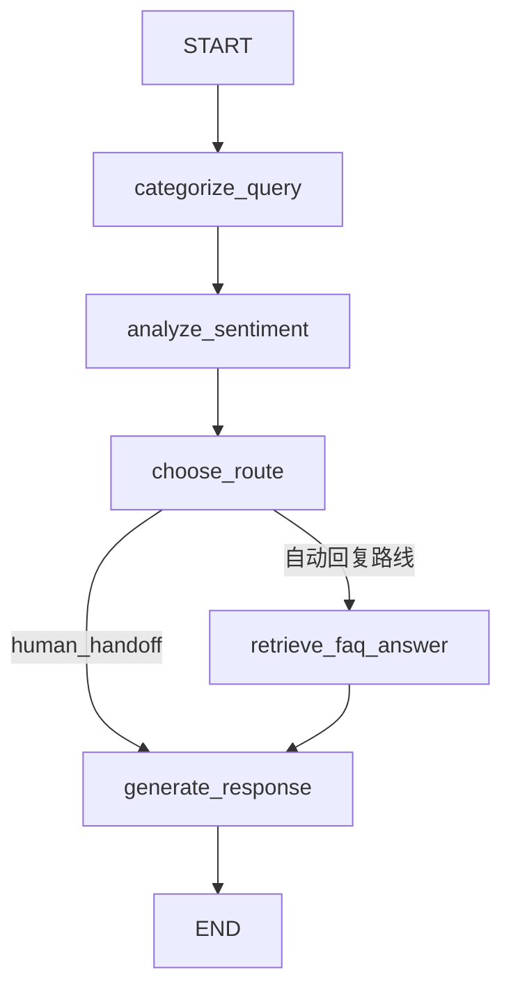
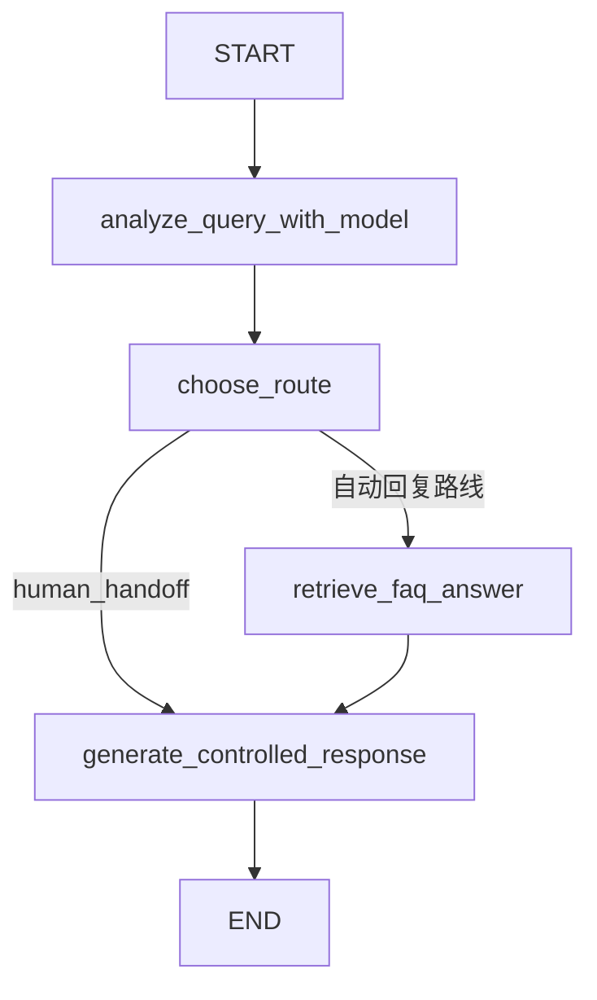

# 客服 Agent 轻量 RAG 系统升级手册

> 本文对应项目目录：`D:\codexTest\customer-service-agent-learning`  
> 本轮目标：把原来的内存关键词 FAQ，升级成一个**可维护、可解释、可评估、可离线运行**的轻量本地 RAG 检索层。

---

## 1. 本轮完成了什么

本轮完成的不是“把一个字符串换成另一个字符串”，而是把知识检索拆成了四个可以单独理解和验证的层次：

```text
知识存储层
    data/knowledge_base.json
        ↓
知识加载与校验层
    src/knowledge_base.py
        ↓
本地索引与混合排序层
    src/rag_retriever.py
        ↓
Agent 状态接入层
    src/agent.py
        ↓
评估证据持久化层
    src/evaluation_runner.py
```

具体变化如下：

1. FAQ 内容从 Python 文件中的列表迁移到 `data/knowledge_base.json`。
2. 每条知识增加了 `faq_id`、`chunk_id`、标题、正文、来源、版本和更新时间。
3. 增加 JSON 结构校验，避免知识字段缺失、ID 重复或 `answer` 与 `content` 不一致。
4. 新增 `src/rag_retriever.py`，在项目本地构建 TF-IDF 索引。
5. 检索采用“规则门槛 + TF-IDF 文本相似度”的混合方式。
6. 检索结果支持 Top-K 候选，并保留每个候选的解释性分数。
7. `CustomerState` 保存知识库版本、检索方法、规则分、文本分和候选摘要。
8. 评估明细 `results.json` 保存真实检索上下文与候选证据。
9. 评估汇总 `summary.json` 统计真实 FAQ 命中次数、检索方法和知识库版本。
10. 新增 `tests/test_rag_retriever.py`，覆盖 JSON、TF-IDF、混合评分和负例控制。
11. 更新 `README.md`，把项目能力准确描述为“轻量本地混合 RAG”。

当前全量本地测试结果：

```text
Ran 68 tests in 0.037s
OK
```

这些测试没有调用真实模型 API，也没有产生 API 费用。

---

## 2. 为什么原来的实现还不够像 RAG

原来的 `src/knowledge_base.py` 直接在 Python 中维护：

```python
FAQ_ENTRIES = [
    {
        "faq_id": "refund_timing",
        "answer": "...",
        "required_keywords": ("退款",),
        "intent_keywords": ("多久", "什么时候"),
    }
]
```

它已经有“根据用户问题查知识”的行为，但仍然存在几个限制：

### 2.1 知识内容和程序逻辑耦合

如果客服人员要修改 FAQ，必须进入 Python 文件修改代码。

升级后：

```text
业务知识 -> data/knowledge_base.json
检索算法 -> src/rag_retriever.py
工作流逻辑 -> src/agent.py
```

知识和程序职责分离，修改 FAQ 不需要改检索算法。

### 2.2 只有规则分，没有文本相似度

旧算法主要依赖：

```text
主题关键词是否出现
意图关键词命中了几个
```

这对短 FAQ 很稳定，但只能回答“关键词是否出现”，没有独立的文本相似度指标。

升级后每个候选有三种分：

| 字段 | 含义 |
| --- | --- |
| `keyword_score` | 主题和意图规则计算的分数 |
| `text_score` | 查询与文档的 TF-IDF 余弦相似度 |
| `score` | 两者融合后的最终检索分 |

### 2.3 没有检索证据链

只保存一个 `faq_answer`，只能知道最终用了什么答案，不容易回答：

- 为什么命中这个 FAQ？
- 当时使用的是哪一版知识库？
- 有没有其他候选？
- 最终回复依据的上下文是什么？

升级后状态中保存：

```python
{
    "faq_id": "refund_timing",
    "retrieved_contexts": [
        "退款申请审核通过后，原路退款通常在 3 至 5 个工作日到账。"
    ],
    "retrieval_score": 0.834833,
    "retrieval_keyword_score": 0.583333,
    "retrieval_text_score": 0.603599,
    "retrieval_method": "keyword_tfidf_hybrid_v1",
    "knowledge_base_version": "2026.08.18",
    "retrieval_candidates": [...]
}
```

这才具备 RAG 评估和问题排查所需要的“检索可追踪性”。

---

## 3. 本轮修改的文件

### 3.1 新增文件

| 文件 | 职责 |
| --- | --- |
| `D:\codexTest\customer-service-agent-learning\data\knowledge_base.json` | 版本化知识文档 |
| `D:\codexTest\customer-service-agent-learning\src\rag_retriever.py` | TF-IDF 索引、规则门槛和混合排序 |
| `D:\codexTest\customer-service-agent-learning\tests\test_rag_retriever.py` | RAG 检索离线单元测试 |

### 3.2 修改文件

| 文件 | 修改内容 |
| --- | --- |
| `src/knowledge_base.py` | JSON 加载、字段校验、兼容旧查询接口 |
| `src/agent.py` | 状态字段、Top-K 候选、知识版本和检索证据 |
| `src/evaluation_runner.py` | 评估结果与汇总报告保存 RAG 证据 |
| `tests/test_agent.py` | 验证混合分与检索候选 |
| `tests/test_evaluation_runner.py` | 验证评估器保存检索证据 |
| `README.md` | 同步架构、测试数和 RAG 限制 |

---

## 4. 知识文档格式：`data/knowledge_base.json`

文件顶层结构：

```json
{
  "knowledge_base_name": "customer_service_faq",
  "knowledge_base_version": "2026.08.18",
  "documents": []
}
```

### 4.1 `knowledge_base_name`

这是知识库的逻辑名称。它不等于文件名，作用是让报告知道使用的是哪个知识库。

例如：

```text
customer_service_faq
```

以后可以有：

```text
customer_service_faq
customer_service_policy
customer_service_product_manual
```

### 4.2 `knowledge_base_version`

这是一次知识快照的版本号。

用户运行评估后，如果修改了 FAQ 正文，应同步更新版本。这样报告可以回答：

```text
这次评估究竟使用了哪版知识？
```

本轮版本：

```text
2026.08.18
```

### 4.3 `faq_id`

稳定的业务知识 ID：

```json
"faq_id": "refund_timing"
```

正文可以润色，但 `faq_id` 尽量保持不变。评估集使用这个 ID 判断是否检索到了正确知识。

### 4.4 `chunk_id`

当前每条 FAQ 很短，因此一条 FAQ 暂时只有一个文本块：

```json
"chunk_id": "refund_timing#0"
```

以后长文可以拆成：

```text
refund_timing#0
refund_timing#1
refund_timing#2
```

`faq_id` 表示业务知识，`chunk_id` 表示该知识的具体文本块。

### 4.5 `title` 和 `content`

```json
"title": "退款到账时效",
"content": "退款申请审核通过后，原路退款通常在 3 至 5 个工作日到账。"
```

`title` 用于人阅读和索引，`content` 是真正可以提供给回复模型的可信上下文。

### 4.6 `category`

```json
"category": "billing"
```

当前支持：

```text
technical
billing
general
```

这个字段目前主要用于知识元数据和后续统计，并没有替代 Agent 的分类节点。

### 4.7 `source`、`version`、`updated_at`

```json
"source": "project_faq",
"version": "1.0",
"updated_at": "2026-08-12"
```

它们用于回答“这条知识从哪里来、具体是哪一版本、什么时候更新”。

### 4.8 `required_keywords` 和 `intent_keywords`

```json
"required_keywords": ["退款"],
"intent_keywords": ["多久", "什么时候", "几天", "工作日", "多长时间", "何时"]
```

两组关键词含义不同：

- `required_keywords`：业务主题门槛，当前条目要求全部命中。
- `intent_keywords`：用户意图门槛，至少命中一个。

所以：

```text
退款一般多久到账？
```

会命中：

```text
主题：退款
意图：多久
```

而：

```text
退款已经到账，谢谢客服！
```

虽然包含“退款”和“到账”，但没有询问时效的意图关键词，因此被拦截。

### 4.9 `answer`

```json
"answer": "退款申请审核通过后，原路退款通常在 3 至 5 个工作日到账。"
```

这是为了兼容旧代码保留的字段。本轮加载器强制要求：

```text
answer == content
```

这样可以避免检索上下文和最终 FAQ 答案出现两份互相矛盾的内容。

---

## 5. 知识加载：`src/knowledge_base.py`

### 5.1 为什么要在启动时加载

模块导入时执行：

```python
KNOWLEDGE_BASE_METADATA, FAQ_ENTRIES = load_knowledge_base()
```

好处是：

1. JSON 文件不存在时，程序启动就暴露问题。
2. JSON 格式错误时，不会等到用户请求才失败。
3. 后续检索器可以直接使用经过校验的 Python 数据。

### 5.2 `load_knowledge_base()` 的执行顺序

```text
读取文件
    ↓
解析 JSON
    ↓
检查顶层对象
    ↓
读取知识库名称和版本
    ↓
检查 documents 数组
    ↓
逐条检查 FAQ 字段
    ↓
检查 faq_id 和 chunk_id 是否重复
    ↓
检查 answer 是否等于 content
    ↓
转换为 TypedDict 结构
    ↓
返回 metadata, entries
```

### 5.3 为什么要检查重复 ID

如果两个文档都写成：

```text
faq_id = refund_timing
```

评估器无法判断到底命中的是哪一条，报告也无法稳定比较。因此加载器会在启动时直接报错。

### 5.4 为什么保留 `find_faq_answer()`

项目早期已经有这些接口：

```python
find_faq_answer(query)
find_faq_entry(query)
search_faq_entries(query)
```

本轮没有强制删除它们，而是在 `knowledge_base.py` 里保留兼容包装。旧 CLI、旧测试和已有学习笔记仍然可以使用原接口，真正的算法已经转发到 `rag_retriever.py`。

---

## 6. 本地 TF-IDF 索引：`src/rag_retriever.py`

### 6.1 为什么没有直接安装向量数据库

当前项目的知识量只有三条 FAQ，目标是：

- 面试官 clone 后离线运行；
- 单元测试不依赖网络；
- 不增加数据库服务；
- 让你能看懂每一行检索逻辑。

所以本轮使用 Python 标准库实现一个小型 TF-IDF 索引。它适合学习和小规模演示，不冒充生产级向量数据库。

### 6.2 分词方式

函数：

```python
tokenize_for_tfidf(text)
```

对中文文本生成：

1. 单字 n-gram；
2. 双字 n-gram。

例如：

```text
退款什么时候到账
```

会得到部分词项：

```text
退、款、什、么、时、候、到、账
退款、款什、什么时候、候到、到账
```

单字可以提高短句覆盖率，双字可以提高“到账”“重置”等局部短语的区分度。

### 6.3 文档索引文本

每条文档进入索引时使用：

```text
title + content + required_keywords + intent_keywords
```

索引包含关键词是为了让已通过规则门槛的短查询仍能得到稳定的本地文本分；但它不会绕过严格门槛。

### 6.4 TF-IDF 直观含义

TF-IDF 可以理解为：

```text
某个词在当前文档里出现得多
并且在其他文档里不常见
=> 这个词更能代表当前文档
```

本项目使用平滑后的逆文档频率：

```text
idf(term) = log((文档总数 + 1) / (包含该词的文档数 + 1)) + 1
```

这样即使词出现在所有文档中，也不会出现除零。

### 6.5 余弦相似度

查询和文档都会变成 TF-IDF 向量。余弦相似度计算：

```text
cosine = dot(query, document)
         / (|query| * |document|)
```

结果范围被限制在：

```text
0.0 <= text_score <= 1.0
```

分数越高，表示两段文本的词项分布越接近。

---

## 7. 混合检索：为什么不能只用 TF-IDF

本项目没有使用：

```text
TF-IDF 分数最高就直接命中
```

而是先执行：

```python
keyword_score = _keyword_score(query, entry)
```

如果主题和意图规则没有通过，返回 `None`，候选直接丢弃。

### 7.1 规则分

主题通过后固定获得 `0.5`：

```text
主题分 = 0.5
```

命中的意图词越多，后半部分越高：

```text
keyword_score = 0.5 + 0.5 * (
    命中的意图词数量 / 意图词总数
)
```

对于：

```text
退款一般多久到账？
```

只命中“多久”一个意图词：

```text
keyword_score = 0.5 + 0.5 * (1 / 6)
              = 0.583333...
```

### 7.2 混合分

本项目使用：

```text
score = keyword_score
        + (1 - keyword_score) * text_score
```

这个公式的设计含义：

- 规则门槛先提供可信的基础分；
- TF-IDF 只能补充剩余的不确定性；
- 文本相似度不能把没有表达正确意图的问题强行变成 FAQ 命中。

实际退款查询的观测结果：

```text
keyword_score = 0.583333
text_score    = 0.603599
score         = 0.834833
```

### 7.3 为什么负例仍然返回空列表

查询：

```text
退款已经到账，谢谢客服！
```

可能和退款文档共享部分词项，但 `_keyword_score()` 会发现没有“多久、什么时候、几天、工作日、多长时间、何时”中的任何一个，因此：

```python
keyword_score is None
```

候选不会进入混合排序，最终结果：

```python
[]
```

这就是“负例控制”：

```text
相似度是排序证据，不是业务意图判断的唯一依据。
```

---

## 8. Top-K 候选和阈值

检索函数：

```python
search_faq_entries(query, top_k=3)
```

它的执行顺序：

```text
检查 top_k > 0
    ↓
空查询直接返回 []
    ↓
遍历所有知识文档
    ↓
执行主题/意图硬门槛
    ↓
计算 TF-IDF 文本分
    ↓
计算混合分
    ↓
按 score 降序排列
    ↓
faq_id 作为稳定并列排序键
    ↓
截取前 top_k 条
```

`src/agent.py` 中当前请求 `top_k=3`，但最终回复只使用第一名的可信正文。其余候选保留为：

```python
retrieval_candidates
```

这样后续可以：

- 在调试页面展示候选；
- 评估 Top-K 召回；
- 接入 RAGAS 的上下文评估；
- 在知识库增大后观察候选竞争。

### 8.1 阈值作用

`src/agent.py` 中的：

```python
MIN_RETRIEVAL_SCORE = 0.55
```

只有最佳候选分数达到阈值，才会写入 FAQ 上下文。

低于阈值时：

```python
return {}
```

这意味着后续回复节点看不到 `faq_answer`，会使用本地通用回复，而不是把低可信内容交给模型。

---

## 9. `CustomerState` 新增字段

文件：

```text
D:\codexTest\customer-service-agent-learning\src\agent.py
```

字段含义：

| 字段 | 类型 | 作用 |
| --- | --- | --- |
| `faq_id` | `FaqId` | 最佳命中文档的稳定 ID |
| `faq_answer` | `str` | 兼容旧流程的最佳答案 |
| `retrieved_contexts` | `list[str]` | 实际提供给回复流程的上下文 |
| `retrieval_score` | `float` | 最终混合分 |
| `retrieval_keyword_score` | `float` | 规则相关性分 |
| `retrieval_text_score` | `float` | TF-IDF 文本分 |
| `retrieval_method` | `str` | 算法版本 |
| `retrieval_candidates` | `list[dict]` | Top-K 候选摘要 |
| `knowledge_base_name` | `str` | 知识库名称 |
| `knowledge_base_version` | `str` | 知识库版本 |

### 9.1 FAQ 未命中时为什么不写零值

未命中时这些字段不会被伪造：

```text
没有 faq_id
没有 faq_answer
没有 retrieved_contexts
没有 retrieval_score
```

这和写成：

```python
retrieval_score = 0.0
```

含义不同。`0.0` 表示“发生了检索并计算出零分”，而缺少字段表示“没有产生可信检索结果”。

---

## 10. LangGraph 完整执行链

规则版 LangGraph 入口：

```text
src/langgraph_agent.py
run_langgraph_customer_service_agent(query)
```

大模型版 LangGraph 入口：

```text
src/langgraph_llm_agent.py
run_langgraph_llm_customer_service_agent(query)
```

### 10.1 规则版



### 10.2 大模型版



### 10.3 退款时效问题的实际执行

输入：

```text
退款一般多久到账？
```

执行：

```text
1. 分析节点得到 category=billing, sentiment=neutral
2. 路由节点得到 route=billing_reply
3. 条件边允许进入 retrieve_faq_answer
4. JSON 知识库提供三条文档
5. 规则门槛只保留 refund_timing
6. TF-IDF 计算 text_score
7. 混合分达到阈值
8. 写入 faq_id、上下文、分数和版本
9. 回复节点使用 faq_answer
10. 返回最终 CustomerState
```

### 10.4 负面问题的实际执行

输入：

```text
退款一个月还没到账，太差了！
```

执行：

```text
1. 分类为 billing
2. 情绪为 negative
3. 路由为 human_handoff
4. 条件边跳过 FAQ 检索
5. 本地生成人工转接回复
```

这里跳过 RAG 是有意设计：负面问题优先转人工，不应该先用普通 FAQ 回复激怒用户。

---

## 11. 评估系统如何保存 RAG 证据

文件：

```text
D:\codexTest\customer-service-agent-learning\src\evaluation_runner.py
```

每条 `EvaluationResult` 现在可以保存：

```json
{
  "retrieved_contexts": [
    "退款申请审核通过后，原路退款通常在 3 至 5 个工作日到账。"
  ],
  "retrieval_score": 0.834833,
  "retrieval_keyword_score": 0.583333,
  "retrieval_text_score": 0.603599,
  "retrieval_method": "keyword_tfidf_hybrid_v1",
  "retrieval_candidates": [
    {
      "rank": 1,
      "faq_id": "refund_timing",
      "chunk_id": "refund_timing#0",
      "title": "退款到账时效",
      "source": "project_faq",
      "version": "1.0",
      "score": 0.834833,
      "keyword_score": 0.583333,
      "text_score": 0.603599
    }
  ],
  "knowledge_base_name": "customer_service_faq",
  "knowledge_base_version": "2026.08.18"
}
```

### 11.1 汇总新增字段

`build_summary()` 增加：

| 字段 | 含义 |
| --- | --- |
| `retrieval_hit_count` | 真正存在 `faq_answer` 的样本数量 |
| `retrieval_method_counts` | 各检索方法的命中次数 |
| `knowledge_base_version_counts` | 各知识库版本的命中次数 |

注意：

```text
FAQ 未命中不计入 retrieval_hit_count。
```

这避免把“没有产生检索结果”误报成“检索分数为 0”。

### 11.2 为什么报告要记录知识库版本

如果本周 FAQ 内容是：

```text
3 至 5 个工作日到账
```

下周改为：

```text
2 至 7 个工作日到账
```

相同评估问题可能产生不同答案。如果报告不记录知识版本，就无法判断质量变化来自：

- Agent 代码变化；
- 知识内容变化；
- 模型变化；
- 评估集变化。

因此知识版本是可复现实验的必要元数据。

---

## 12. 测试覆盖说明

新增测试文件：

```text
D:\codexTest\customer-service-agent-learning\tests\test_rag_retriever.py
```

测试内容：

### 12.1 JSON 版本和 chunk

验证：

```text
知识库名称正确
知识库版本存在
三条文档都成功加载
chunk_id 稳定
```

### 12.2 JSON 一致性

构造一个临时 JSON，让：

```text
content != answer
```

预期抛出 `ValueError`。

### 12.3 中文分词

验证：

```text
退
退款
到账
```

都能生成，证明单字和双字 n-gram 都在工作。

### 12.4 混合分

验证：

```text
keyword_score > 0.5
text_score > 0
score >= keyword_score
score <= 1
```

### 12.5 FAQ 负例

验证：

```text
退款已经到账，谢谢客服！
```

返回：

```python
[]
```

### 12.6 本地索引

验证 TF-IDF 索引可以在没有网络、没有数据库的情况下构建，并能为密码重置查询产生正相似度。

### 12.7 Agent 状态

`tests/test_agent.py` 额外验证：

```text
retrieval_keyword_score
retrieval_text_score
retrieval_method
knowledge_base_version
retrieval_candidates
```

### 12.8 运行命令

只运行 RAG 测试：

```powershell
Set-Location D:\codexTest\customer-service-agent-learning
.\.venv\Scripts\python.exe -m unittest discover -s .\tests -p "test_rag_retriever.py" -v
```

运行知识库与 Agent 测试：

```powershell
.\.venv\Scripts\python.exe -m unittest discover -s .\tests -p "test_knowledge_base.py" -v
.\.venv\Scripts\python.exe -m unittest discover -s .\tests -p "test_agent.py" -v
```

运行全量测试：

```powershell
.\.venv\Scripts\python.exe -m unittest discover -s .\tests -v
```

预期：

```text
Ran 68 tests
OK
```

---

## 13. 手工查看 RAG 结果

### 13.1 查看候选

```powershell
.\.venv\Scripts\python.exe -c "from src.rag_retriever import search_faq_entries; print(search_faq_entries('退款一般多久到账？'))"
```

可以看到：

```text
faq_id=refund_timing
keyword_score=0.583333
text_score=0.603599
score=0.834833
retrieval_method=keyword_tfidf_hybrid_v1
```

### 13.2 查看完整 LangGraph 状态

```powershell
.\.venv\Scripts\python.exe -c "from src.langgraph_agent import run_langgraph_customer_service_agent; print(run_langgraph_customer_service_agent('退款一般多久到账？'))"
```

重点观察：

```text
category
sentiment
route
faq_id
retrieved_contexts
retrieval_score
retrieval_candidates
knowledge_base_version
response
```

### 13.3 查看负例

```powershell
.\.venv\Scripts\python.exe -c "from src.rag_retriever import search_faq_entries; print(search_faq_entries('退款已经到账，谢谢客服！'))"
```

预期：

```text
[]
```

---

## 14. 本轮 RAG 的边界

本轮已经完成的是：

```text
文件化知识库
本地索引
规则 + 文本混合检索
Top-K 候选
阈值过滤
上下文保存
版本追踪
离线测试
评估报告证据
```

本轮暂时没有实现：

```text
Embedding 模型
向量数据库
跨段落语义召回
RAGAS
自动知识库同步
生产级权限和审核
```

因此简历中应写：

> 设计并实现轻量本地混合 RAG 检索层，采用意图关键词硬门槛与 TF-IDF 相似度排序，支持 Top-K 候选、阈值过滤、FAQ ID/上下文/知识版本追踪和离线回归测试。

不应写成：

> 使用 Milvus/FAISS 向量数据库完成大规模语义检索。

因为当前项目还没有这些组件。

---

## 15. 下一阶段建议

RAG 检索层完成后，下一步可以按以下顺序继续：

1. 扩充知识文档和评估集，加入更多 FAQ 与真实同义问法。
2. 为每条样本增加参考答案和实际检索上下文。
3. 接入 RAGAS，评估 Context Precision、Context Recall、Faithfulness 和 Answer Relevancy。
4. 生成检索分布和 RAGAS 图表。
5. 加 FastAPI、离线模式和浏览器页面。
6. 加 Docker 和 GitHub Actions。

当前最重要的学习结论是：

```text
RAG 不只是“把文档传给模型”。
一个可维护的 RAG 系统还必须回答：
知识从哪里来？
检索为什么命中？
上下文是什么？
用了哪一版知识？
低相关结果如何被拒绝？
这些行为如何被测试和评估？
```

